

  <strong>Cambiar idioma:</strong> 
  <u>Español</u> | <a href="./en/">English</a>

[LINKEDIN: Luis Andrés Aponte San Román](https://www.linkedin.com/in/luis-andres-aponte-san-roman/) 

📧 [MICROSOFT OUTLOOK: andres_laasr20@outlook.com](mailto:andres_laasr20@outlook.com)

📱 +52 5539249978

*¡Hola! Te doy la bienvenida a mi portafolio de proyectos de Análisis de Datos.*

# Acerca de mí

Ingeniero mecánico y consultor de ERP certificado en análisis de datos con sólida experiencia en extracción, limpieza y modelado de datos estratégicos.

Especialista en el ciclo completo del dato: desde la extracción y limpieza de grandes volúmenes de información, hasta el modelado predictivo y el diseño de tableros interactivos. Automatizo flujos de trabajo ETL para reducir tiempos de procesamiento y transformo datos complejos en tableros visuales que guían las decisiones del negocio.

### Habilidades tecnológicas
* Análisis y gestión de datos utilizando **Excel / SQL / Python**
* Visualización de datos y narración de historias usando **Tableau / Power BI**
* Transferencia de información entre sistemas usando **API / Postman**
* Digitalización de business operations usando **ERP (Microsoft Dynamics 365 ERP's)**
* Adopción de IA como asistente de investigación y optimización de mis entregables usando **GitHub Copilot / Copilot / Gemini 3.1 Pro**
* Generación de diagramas de flujo de procesos usando **Microsoft Visio**
* Gestión de hitos y tareas de proyecto usando **Azure DevOps**
* Documentación de proyectos de data usando **Jupyter Notebooks**
* Gestión de documentación de proyectos usando **Microsoft SharePoint / Microsoft OneDrive**

### Habilidades blandas
Análisis de datos | Resolución de problemas | Comunicación efectiva | Trabajo en equipo | Orientación a resultados | Organización | Proactividad | Atención al detalle | Optimización de Procesos

## Índice de Proyectos

### Área: Análisis de Patrones en Datos de Negocio
* [Optimización de gastos de distribuidora de entrada a eventos de entretenimiento](#optimización-de-gastos-de-distribuidora-de-entrada-a-eventos-de-entretenimiento)
* [Análisis de retención de clientes para gimnasio](#análisis-de-retención-de-clientes-para-gimnasio)

### Área: Dashboards y Visualización
* [Análisis de tendencias de categorías consumidas en Youtube](#análisis-de-tendencias-de-categorías-consumidas-en-youtube)
* [Dashboard para análisis ejecutivo y comercial de ventas para tienda online](#dashboard-para-análisis-ejecutivo-y-comercial-de-ventas-para-tienda-online)

### Área: Ingeniería de Datos y SQL
* [Análisis de tendencias y patrones de cancelación en servicio de suscripción para empresa de telecomunicaciones](#análisis-de-tendencias-y-patrones-de-cancelación-en-servicio-de-suscripción-para-empresa-de-telecomunicaciones)
* [Análisis de rendimiento de ventas y análisis de cohortes](#análisis-de-rendimiento-de-ventas-y-análisis-de-cohortes)

## Proyectos Seleccionados

## Optimización de gastos de distribuidora de entrada a eventos de entretenimiento

Showz es una empresa de venta de entradas de eventos. Anteriormente a la ejecución del proyecto, la empresa se encontraba en una situación de toma de decisiones en cuanto a la regulación de sus gastos de operación, buscando identificar el comportamiento y participación de sus fuentes de anuncios y dispositivos en los que se encuentra habilitada la plataforma de ventas de la empresa, con el propósito principal de que los descubrimientos generados permitan una claridad precisa para la toma de decisiones respecto a la optimización o descarte de fuentes de anuncios y dispositivos.

### Herramientas y Proceso de Datos

### Preguntas clave

1. ¿Cómo los clientes usan el servicio?
2. ¿Cuándo empiezan a comprar?
3. ¿Cuánto dinero aporta cada cliente a la compañía?
4. ¿Cuándo los ingresos cubren el costo de adquisición de los clientes?

### Metodología

- **Preprocesamiento de datos:** Se limpiaron y estandarizaron los datos, eliminando inconsistencias y verificando la ausencia de duplicados y valores faltantes.
- **Exploratory Data Analysis (EDA):** Análisis de métricas para identificación de tendencias (entre fuentes de anuncios y entre dispositivos touch y desktop):
   - Tasa de conversión
   - Tamaño promedio de orden
   - LTV
   - CAC
   - ROMI

- **Generación de visualizaciones de datos:** Se definieron gráficos de histogramas, barras, mapas de calor; con la intención de contar con recursos que permitan al cliente el entendimiento más sencillo de las métricas y descubrimientos obtenidos.

### Conclusiones y recomendaciones

**RECOMENDACIONES DE FUENTES/PLATAFORMAS**

- FUENTES ALTAMENTE RECOMENDADAS 🏆
  - FUENTE 1 - PRIORIDAD MÁXIMA

  Métricas clave: ROMI = 113.2%, CAC = 4.04, LTV = 1.12
  
  Fundamentación: Combina la mejor rentabilidad con eficiencia en costos
  
  Recomendación: INCREMENTAR presupuesto en 50-100%
  
  - FUENTE 2 - ALTA PRIORIDAD

  Métricas clave: ROMI = 43.7%, CAC = 9.05, LTV = 1.29
  
  Fundamentación: Rentable y genera el mayor LTV promedio
  
  Recomendación: INCREMENTAR presupuesto en 30-50%
  
- FUENTES A REEVALUAR CRÍTICAMENTE ⚠️
  - FUENTE 3 - ACCIÓN INMEDIATA REQUERIDA

  Métricas clave: ROMI = -70.0%, CAC = 14.74, Mayor volumen pero pérdidas masivas
  
  Fundamentación: A pesar de generar 9,587 clientes, produce pérdidas de 98,878
  
  Recomendación: SUSPENDER temporalmente y optimizar estrategia
  
- FUENTES A ELIMINAR O REDUCIR 🔻
  - FUENTES 4, 5, 9, 10

  Métricas clave: ROMI negativo (-11.4% a -30.9%)
  
  Fundamentación: Todas generan pérdidas consistentes
  
  Recomendación: REDUCIR presupuesto en 70% o ELIMINAR

### Visualizaciones destacadas

- **Mapa de calor del ciclo de vida de la tasa de retención de Showz**

   Observamos que en cada cohorte (mes de primera visita al portal de Showz) por cada mes que pasa, se presenta una tendencia de decremento de la tasa de retención de los clientes (hablando en un sentido general de la empresa, sin distinguir entre fuentes de anuncios o dispositivos. Esto denota para Shows una alerta para tener claro que es relevante realizar una investigación a profundización de en qué medios es donde se está presentando esta perdida de interés del cliente.

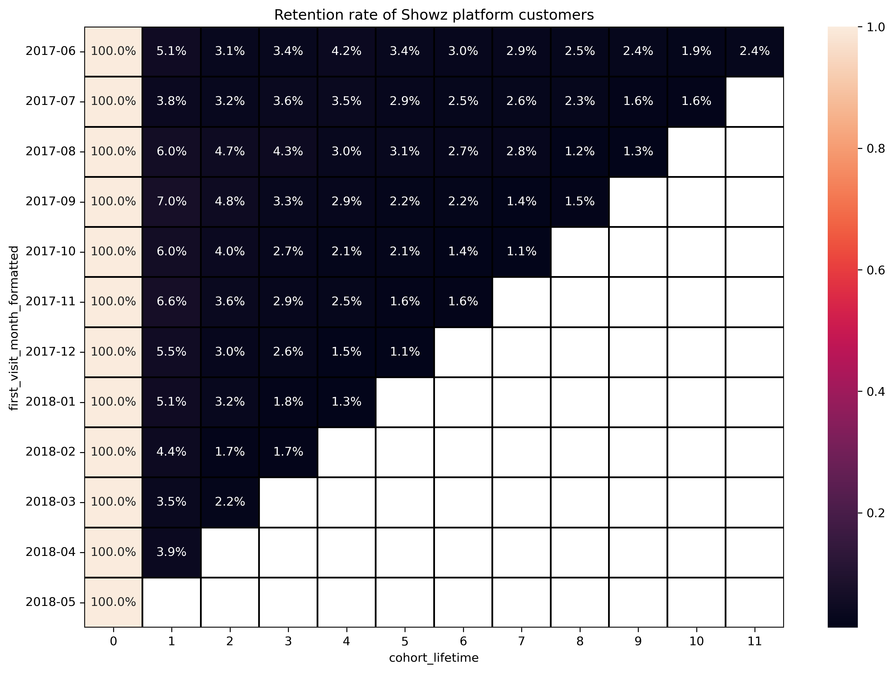

- **Rangos de días requeridos para conversión de clientes (análisis por dispositivos)**

   Se puede percibir que el dispositivo "desktop" mantiene un mejor comportamiento de conversión de clientes, puesto que este dispositivo muestra una considerable cantidad de clientes que el mismo día que se registraron, realizaron una compra en la plataforma de Showz. Por otra parte, el dispositivo "touch" tiene una cantidad considerablemente menor de clientes que realizaron una compra el mismo día que se registraron. El mismo comportamiento de diferencia de conversión de clientes entre dispositivos se puede percibir para los otros 3 rangos de días.

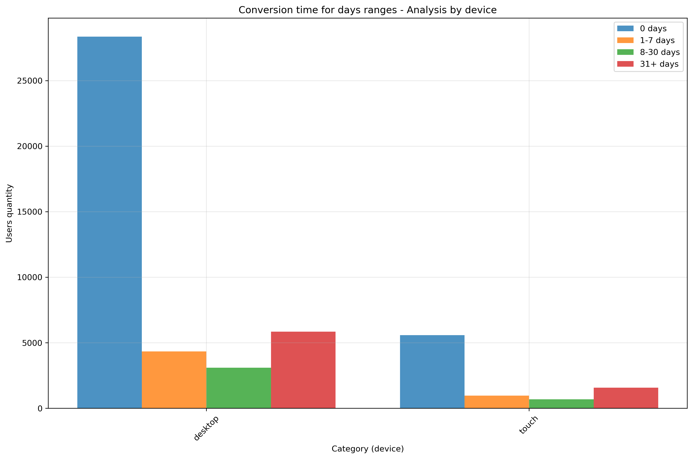

- **Análisis de clientes únicos con participación en plataforma por unidad de tiempo**

   Este análisis entrega información de utilidad para conocer el comportamiento dentro de la plataforma por distintas unidades de tiempo (día, semana y mes). Mediante estos gráficos se puede detectar comportamientos peculiares debido a fechas festivas, comportamientos temporales durante el año, entre otros comportamientos temporales que agregue valor identificar.

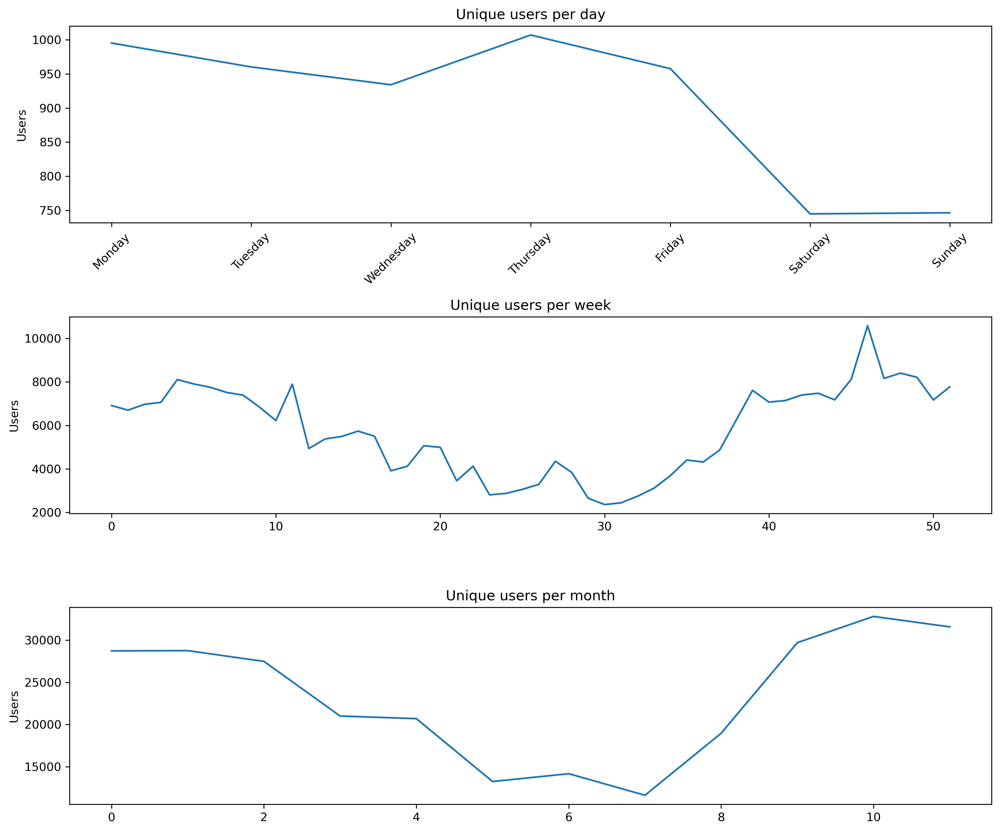

Explora más detalles del proyecto en el [repositorio completo](https://github.com/AndresASR-20/AndresASR-20.github.io/tree/main/assets/projects/project_Business_Analysis).

---

## Análisis de retención de clientes para gimnasio

En todas las industrias, la retención de clientes es fundamental para garantizar ingresos sostenibles y reducir los costos asociados con la adquisición de nuevos clientes. LLevando esta situación de retención de clientes al sector de los servicios de gimnasio, uno de los problemas más comunes que enfrentan los gimnasios y otros servicios es la pérdida de clientes. ¿Cómo descubres si un/a cliente ya no está contigo? En el caso de un gimnasio, tiene sentido decir que un/a cliente se ha ido si no viene durante un mes. Por supuesto, es posible que se hayan ido de viaje y retomen sus visitas cuando regresen, pero ese no es un caso típico. Por lo general, si un/a cliente se une, viene varias veces y luego desaparece, es poco probable que regrese. Identificar los factores clave que influyen en la retención y cancelación permite al gimnasio Model Fitness anticiparse a los riesgos de abandono, diseñar estrategias de fidelización efectivas y personalizar las experiencias para cada cliente.

### Herramientas y Proceso de Dastos

### Preguntas clave

1. ¿Qué factores demográficos o de comportamiento influyen más en la cancelación?
2. ¿Qué características diferencian a los clientes leales de los que abandonan?
3. ¿Cómo se pueden segmentar los clientes para diseñar estrategias personalizadas?

### Metodología

- **Preprocesamiento de datos:** Se limpiaron y estandarizaron los datos, eliminando inconsistencias y verificando la ausencia de duplicados y valores faltantes.
- **Explorartory Data Analysis (EDA):** Se analizaron características demográficas y de uso, identificando patrones en clientes que permanecen y los que cancelan.
- **Modelado predictivo:** Se entrenaron modelos de regresión logística y bosque aleatorio para predecir la cancelación de clientes con un precisión del 85% y 84%, respectivamente.
- **Clustering:** Se segmentaron los clientes en grupos utilizando K-means para identificar comportamientos similares.

### Conclusiones y recomendaciones

#### GRUPOS OBJETIVO PRIORITARIOS
- ALTA PRIORIDAD - Clúster 3 "Nuevos y jóvenes" (55.8% cancelación)

Perfil: Clientes de 26.9 años promedio, nuevos (1.7 meses), contratos cortos

- PRIORIDAD MEDIA - Clúster 2 "Distantes geográficamente" (44.9% cancelación)

Perfil: Ninguno vive cerca del gimnasio, contratos cortos

**Acciones específicas:**

- Convenios con apps de transporte (Uber/taxi con descuento)
- Horarios extendidos para mayor flexibilidad
- Clases virtuales complementarias
- Programa de referidos con bonificaciones especiales

#### MEDIDAS PARA REDUCIR LA ROTACIÓN

A) ESTRATEGIAS PREVENTIVAS

- Para nuevos miembros (primeros 3 meses):
   - Metas progresivas personalizadas
   - Descuentos progresivos por permanencia

B) ESTRATEGIAS DE RETENCIÓN ACTIVA

- Monitoreo de señales de alerta:
   - Frecuencia de visitas < 1.5 veces/mes → Intervención inmediata
   - Contratos de 1 mes → Oferta automática de extensión con beneficios
   - Sin teléfono registrado → Campaña especial de contacto

#### APROVECHAMIENTO DE GRUPOS LEALES

##### Clúster 1 "Comprometidos de largo plazo" (1.5% cancelación)

Estrategia: Convertirlos en embajadores de marca

Acciones:
- Programa VIP con beneficios exclusivos
- Comisiones por referir nuevos miembros
- Acceso prioritario a nuevas clases/equipos

##### Clúster 0 "Promocionales VIP" (13.9% cancelación)

Estrategia: Maximizar el poder del marketing boca a boca

Acciones:
- Ampliar programa de referidos
- Eventos especiales para empresas asociadas
- Descuentos familiares/grupales
 
#### MÉTRICAS DE SEGUIMIENTO RECOMENDADAS
- KPIs mensuales por clúster:
   - Tasa de cancelación por grupo
   - Frecuencia promedio de visitas
   - Tiempo promedio de permanencia
   - ROI de programas de retención específicos

### Visualizaciones destacadas

- **Mapa de calor de correlación entre características**

   Se encontró que Las características month_to_end_contract y contract_period están altamente correlacionadas (0.9), lo que sugiere que se debe tener cuidado con la multicolinealidad al desarrollar modelos predictivos.

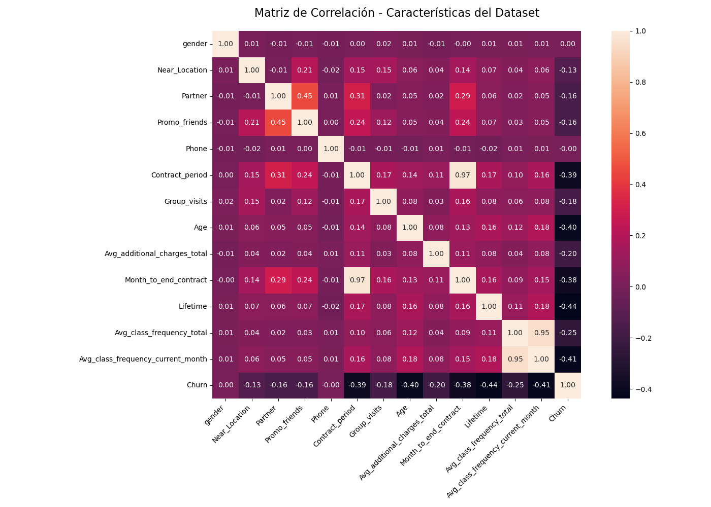

- **Histograma de características con base en estátus de cliente (vigente o cancelado)**

   Este tipo de visualizaciones de datos agregan un valor visual considerable puesto que pueden representar un apoyo para percibir comportamientos de cada característica, desde un enfoque individual, con base en el estátus de los clientes (vigentes o cancelados).

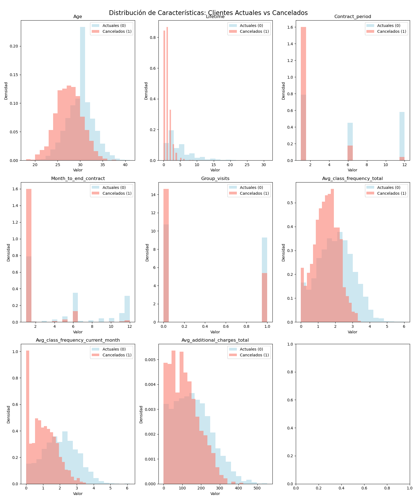

- **Dendograma para análisis de clústeres**

   El dendrograma muestran cómo los clientes se agrupan en segmentos distintos basados en sus características, donde el número óptimo de clústeres sugerido es 4.

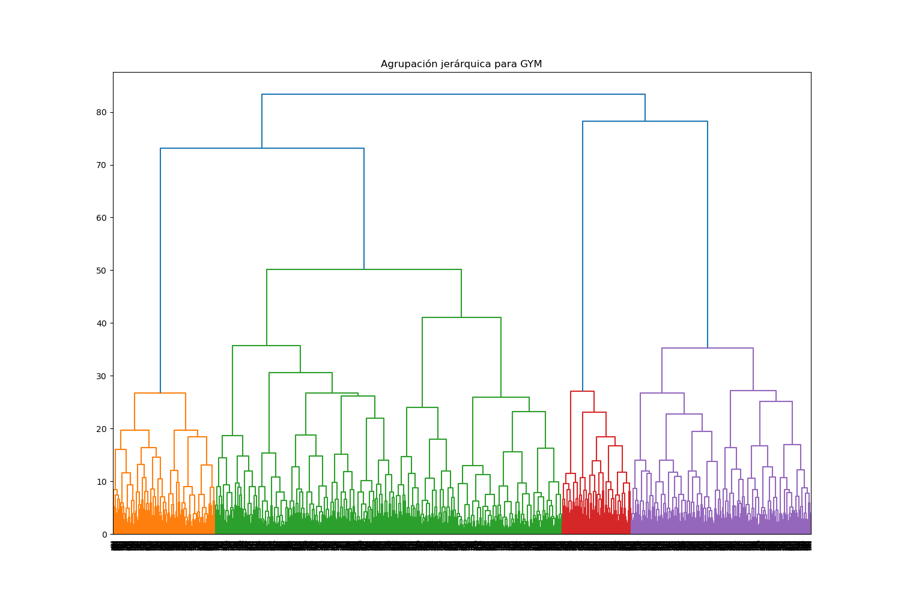

Explora más detalles del proyecto en el [repositorio completo](https://github.com/AndresASR-20/AndresASR-20.github.io/tree/main/assets/projects/project_Data_Modelling).

---

## Análisis de tendencias de categorías consumidas en Youtube

La agencia de publicidad Sterling & Draper tiene la necesidad de analizar tendencias de vídeos en YouTube para determinar qué contenido merece atención para la mercadotecnia. Cada video tiene una categoría específica (entretenimiento, música, noticias y política, etc.), una región y una fecha en que se hace tendencia. Un video puede estar en la sección de tendencias durante varios días seguidos.
Cada semana, es requerido que se genere una respuesta a las siguientes preguntas:

- ¿Qué categorías estaban en las tendencias de la semana pasada?
- ¿Cómo se distribuyeron en diversas regiones?
- ¿Qué categorías fueron particularmente populares en los Estados Unidos?

Para dar solución a la necesidad, se plantea la creación de un dashboard que habilite la solución a las preguntas anteriores. Para ello, se reunen los siguientes requisitos técnicos:

- Objetivo de negocios: analizar el historial de tendencias de videos en YouTube
- Con qué frecuencia se usará el dashboard: al menos una vez al día
- Usuario objetivo del dashboard: gerentes de planificación de videos publicitarios
- Contenido de los datos del dashboard:
   - Tendencias pasadas de videos, ordenadas por día y categoría
   - Tendencias de videos, ordenadas por país
   - Una tabla de correspondencia entre categorías y países
- Parámetros para agrupar los datos:
   - Fecha de tendencia
   - Categoría de video
   - País

### Herramientas y Proceso de Datos

### Preguntas clave

1. ¿Qué categorías estaban en las tendencias de la semana pasada?
2. ¿Cómo se distribuyeron en diversas regiones?
3. ¿Qué categorías fueron particularmente populares en los Estados Unidos?

### Metodología

- **Generación de gráfico para número de videos vistos por categoría y por día**: Se genera un gráfico que es capaz de mostrar las cantidades y proporciones de videos vistos en cada día por cada categoría (uno de valores absolutos y otro de valores porcentuales). Debe reaccionar al ajuste de filtros de región e intervalo de fechas.
- **Generación de gráfico de vistas totales por categoría**: Se genera un pie bar que es capaz de mostrar la proporción de videos vistos por cada categoría, entre el total de videos vistos. Debe reaccionar al ajuste de filtros de región e intervalo de fechas.
- **Generación de tabla de tendencias de videos por país y categoría**: Se genera un mapa de calor que es capaz de mostrar la cantidad de videos vista, donde se menciona la cantidad específica por cada posible combinación independiente de categoría y de región.
- **Generación de dashboard que conjunte gráficos**

### Visualizaciones destacadas

- **Gráfico para número de videos vistos por categoría y por día**

   Se encontró que las categorías que tienden a tener mayor participación en los videos vistos en Youtube en todos los datos recabados en el dataset son principalmente entretenimiento, people & blogs, music, news & politics y comedy

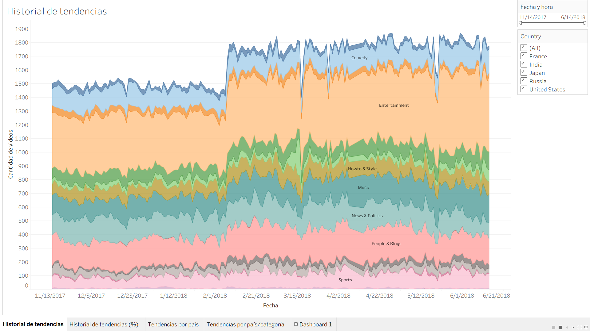

- **Gráfico de vistas totales por categoría**

   Se encontró que las categorías que tienden a tener mayor participación en los videos totales vistos en Youtube en todos los datos recabados en el dataset son principalmente entretenimiento (27.94%), people & blogs (13.15%), music (10.12%), news & politics (10.06%) y comedy (8.67%).

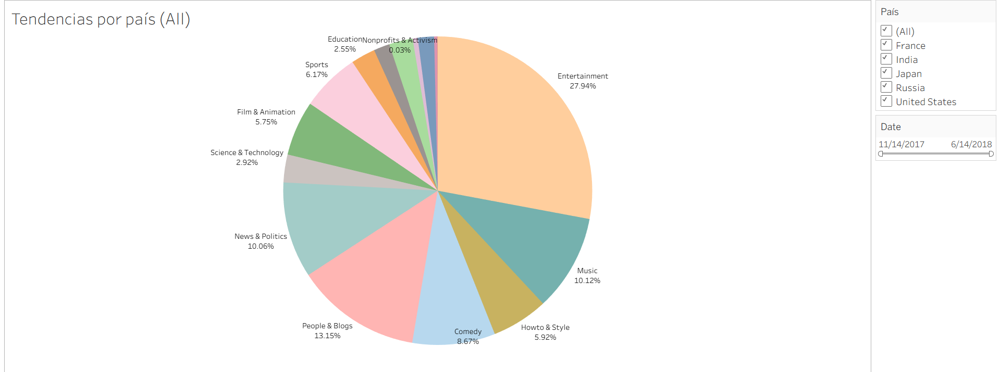

- **Tabla de tendencias de videos por país y categoría**

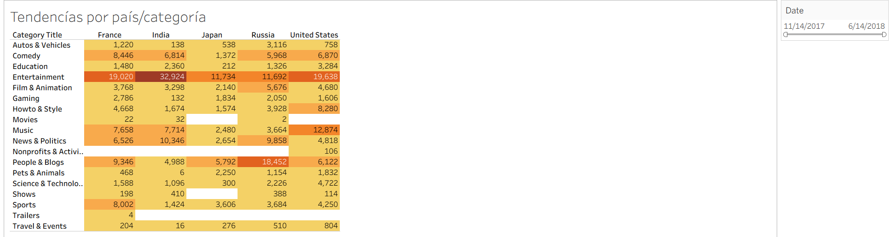

- **Generación de dashboard que conjunte gráficos**

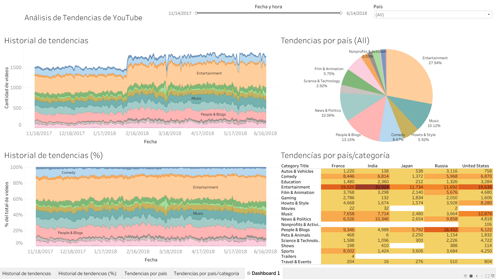

Explora más detalles del proyecto en el [repositorio completo](https://github.com/AndresASR-20/AndresASR-20.github.io/tree/main/assets/projects/project_Data_Visualization).

---

## Dashboard para análisis ejecutivo y comercial de ventas para tienda online 

Este proyecto consistió en el diseño e implementación de un dashboard interactivo en Power BI para una tienda en línea (starter) en etapa de crecimiento continuo. El objetivo principal fue centralizar y estructurar la información proveniente de dos fuentes clave de la empresa: el registro general de ventas (que detalla fechas, clientes y ubicaciones geográficas) y el desglose de cada orden (que desmenuza montos, ganancias, métodos de pago y la jerarquía de categorías y subcategorías de productos). Con esta base, se transformaron los datos crudos en un ecosistema de visualización unificado que equilibra un enfoque ejecutivo de alto nivel con un análisis comercial profundamente operativo.

La solución permite al negocio supervisar continuamente su estatus de ventas mediante el seguimiento de KPIs minoristas críticos como el total de productos vendidos, el valor de venta promedio, el margen de ganancia y el promedio de artículos por transacción. Para responder a las necesidades estratégicas de la empresa, el cuadro de mando fue dotado de herramientas dinámicas que explican el comportamiento temporal y geográfico de los ingresos, la segmentación del consumo por género mediante filtros interactivos y el nivel de participación real de cada categoría en el catálogo. Como resultado, el negocio ahora cuenta con una herramienta clave para agilizar la toma de decisiones y detectar nuevas oportunidades de mercado.

### Herramientas y Proceso de Datos

### Preguntas clave

1. ¿Cómo se comportan las métricas clave del negocio?
2. ¿Cómo se comportan las ventas a través del tiempo? ¿Existen comportamientos inusuales por festividades o temporada del año?
3. ¿Cómo es el comportamiento geográfico de las ventas? ¿Dónde se vende más y dónde se vende menos (hablando de cantidad de órdenes y total vendido)?
4. ¿Qué categorías tienen más venta y cuáles se vende poco?
5. ¿Cuál es el comportamiento de ventas por género? ¿Qué categorías prefiere cada género?

### Metodología

- **Generación de cards para métricas clave de negocio**: Se genera una visualización de valores de métricas clave (venta total, venta por orden promedio, ganancia total, ganancia por orden promedio, porcentaje de margen) para compresión ágil del estatus del negocio.
- **Generación de cards para métricas clave de área comercial**: Se genera una visualización de valores de métricas clave (total artículos vendidos, promedio de cantidad de artículos por orden) para compresión ágil del comportamiento de las ventas desde un enfoque comercial.
- **Generación de gráfico de comportamiento de ventas-ganancias en el tiempo**: Se genera una visualización de gráfico de líneas que permite entender ágilmente cómo han evolucionado las ventas y ganancias a través del tiempo.
- **Generación de gráfico de distribución de ventas geográficamente**: Se genera una visualización de gráfico de mapa en el cual se puede percibir, acorde al tamaño del círculo, dónde se han generado más ventas y, acorde a la tonalidad del color, dónde se ha vendido más.
- **Generación de gráfico de comportamiento de ventas-ganancias por género en el tiempo**: Se genera una visualización de gráfico de líneas que permite entender ágilmente cómo han evolucionado las ventas por género a través del tiempo.
- **Generación de gráfico de comportamiento de artículos vendidos por categoría-subcategoría**: Se genera una visualización de gráfico de barras que permite entender ágilmente la participación de cada categoría y cada subcategoría dentro del total de artículos vendidos por la empresa.
- **Creación de botones, deslizadores y listas filtradoras**: Se crearon elementos visuales para permitir dashboards dinámicos que puedan filtrar la información acorde a fechas, estados y género, que permitan generar un análisis más profundo del comportamiento del negocio.

### Visualizaciones destacadas

- **Dashboard dinámico para análisis ejecutivo**

Se encontró que ha existido un comportamiento controlado y regulado de ganancias del negocio, a pesar de que las ventas han tenido un comportamiento irregular, teniendo un pico de ventas en enero y marzo, y teniendo el declive de ventas en Julio. Adicional, se puede percibir que la zona geográfica con mayor participación de ventas está en Maharashtra y Madhya Pradesh, y las peores participaciones del negocio ocurren en zonas como Sikkim y Haryana. 

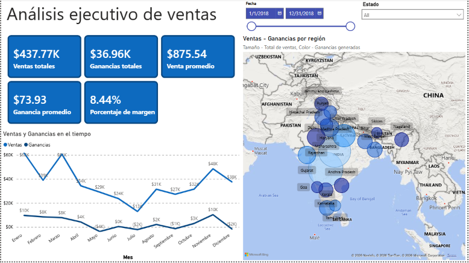

- **Dashboard dinámico para análisis comercial**

Se encontró que existe una variabilidad de la participación de cada genero en las ventas del negocio, siendo observable que el genero femenino tuvo una mayor participación entre marzo a mediados de julio, mientras que el género masculino tuvo una mayor participación durante el periodo restante del año. Adicional, se pudo detectar que las categorías de producto preferidas por los clientes en general son Saree, Hankerchief y Stole; conservando dicha participación individualmente por género. 

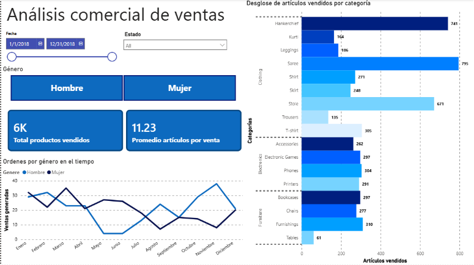

Explora más detalles del proyecto en el [repositorio completo](https://github.com/AndresASR-20/AndresASR-20.github.io/tree/main/assets/projects/project_Data_Visualization_Online_Sales).

---

## Análisis de tendencias y patrones de cancelación en servicio de suscripción para empresa de telecomunicaciones

Este proyecto consistió en el análisis estratégico y la optimización del ecosistema de retención de clientes para una compañía de telecomunicaciones en expansión. El objetivo principal fue centralizar y estructurar la información masiva proveniente de su base de datos de suscriptores (que detalla perfiles demográficos, antigüedad, tipos de contrato y métodos de pago) junto con el desglose del consumo de su suite de servicios avanzados (conectividad por DSL y fibra óptica, herramientas de ciberseguridad, soporte técnico y plataformas de streaming). Con esta base de datos crudos, se implementó un proceso riguroso de limpieza y transformación en PostgreSQL, convirtiendo registros inconsistentes en un entorno analítico unificado que equilibra un diagnóstico financiero de alto nivel con un análisis del comportamiento operativo de los usuarios.

La solución permite al negocio supervisar continuamente su salud comercial mediante el seguimiento de KPIs de retención críticos como la tasa de Churn global, el impacto en ingresos mensuales perdidos, el valor de vida acumulado (Customer Lifetime Value) y la densidad de adopción de servicios por usuario. Para responder a las necesidades estratégicas de la empresa, el análisis fue estructurado para identificar los principales focos rojos de la operación. Como resultado del proyecto, se diseñó e implementó un modelo automatizado de Alerta Temprana (Early Warning) en SQL que aísla de forma proactiva a los 500 clientes activos con mayor probabilidad de abandono según sus patrones de consumo. Gracias a esto, el negocio ahora cuenta con un activo analítico clave para transicionar de una postura reactiva a una estrategia proactiva, agilizando la toma de decisiones comerciales y permitiendo al equipo de Marketing y Customer Success desplegar campañas de lealtad hiper-dirigidas para blindar los ingresos de la compañía.

### Herramientas y Proceso de Datos

### Preguntas clave

- Diagnóstico de Impacto Financiero e Identificación del Problema
1. ¿Cuál es la tasa de Churn global actual de la compañía y cuánto dinero en ingresos mensuales (MonthlyCharges) representa perder a estos clientes?
2. Si analizamos el histórico total (TotalCharges), ¿cuánto dinero han dejado de percibir los clientes que ya abandonaron la empresa en comparación con el valor total acumulado de los que siguen activos?
- Análisis de Portafolio de Servicios (Saturación y Lealtad)
3. Los clientes que contratan internet de Fibra Óptica (Fiber optic), ¿tienen una tasa de Churn más alta o más baja que los que usan DSL? ¿A qué crees que se deba económicamente considerando sus cargos mensuales promedio?
4. ¿El soporte técnico (TechSupport) y la seguridad en línea (OnlineSecurity) realmente retienen clientes? Compara la tasa de Churn de los clientes que tienen estos servicios activados frente a los que no.
5. ¿Cuántos servicios adicionales consumen en promedio los clientes leales frente a los que cancelan? (Servicios a evaluar: OnlineSecurity, OnlineBackup, DeviceProtection, TechSupport, StreamingTV, StreamingMovies).
- Operaciones y Ciclo de Vida del Cliente
6. ¿Cuál es la distribución de antigüedad (tenure) de los clientes que se van? ¿Existe un "mes crítico" o periodo de tiempo (ej. los primeros 6 meses) donde ocurra la mayor parte de las cancelaciones?
7. ¿Cómo afecta el tipo de contrato (Contract) al Churn? Calcula el porcentaje de abandono para contratos Mes a Mes (Month-to-month) vs. Contratos a 1 y 2 años.
- Estrategia de Canales y Facturación (Marketing & Finanzas)
8. ¿El método de pago influye en la deserción? Calcula el Churn Rate desglosado por cada PaymentMethod. ¿Los métodos automáticos (tarjeta/banco) son más efectivos para retener que el cheque electrónico?
9. ¿Los clientes con facturación electrónica (PaperlessBilling = Yes) son más propensos al Churn que los que reciben factura física?
- Alerta Temprana (Enfoque Predictivo)
10. Genera un listado con el customerID de los Top 500 clientes activos con mayor riesgo de Churn para enviarles una oferta mañana por la mañana.

### Metodología

- **Estandarización y conversión de tipos de datos**: Se ejecutó la transformación de la columna `TotalCharges` mediante la eliminación de registros vacíos y la reconfiguración de su tipo de dato a valor numérico flotante (`FLOAT`), corrigiendo inconsistencias estructurales de origen y asegurando la integridad del análisis financiero.
- **Cuantificación del impacto financiero y volumétrico**: Se desarrollaron consultas de agregación para determinar la tasa de Churn global, el volumen exacto de deserción y la fuga de ingresos mensuales recurrentes (`MonthlyCharges`), contrastando estas métricas con el valor histórico acumulado (`TotalCharges`) de los clientes retenidos.
- **Evaluación y segmentación de infraestructura técnica**: Se agruparon y analizaron los perfiles de consumo según el tipo de servicio de internet (`InternetService`), aislando las tasas de cancelación y los costos promedio para identificar discrepancies operativas en la oferta de Fibra Óptica.
- **Análisis de la densidad de adopción de productos**: Se implementó una matriz de lógica condicional utilizando sentencias `CASE WHEN` para sumar el volumen de servicios de valor agregado contratados, midiendo la correlación directa entre el nivel de *cross-selling* y la lealtad a largo plazo del usuario.
- **Mapeo del ciclo de vida y ventanas críticas**: Se estructuró un análisis de cohortes temporales agrupando la antigüedad (`tenure`) en rangos trimestrales y semestrales, logrando localizar con precisión milimétrica el periodo de tiempo con mayor vulnerabilidad operativa.
- **Auditoría contractual y operativa**: Se desglosó el comportamiento de deserción cruzando los esquemas legales de contratación (`Contract`) y los métodos de facturación (`PaperlessBilling`), identificando el riesgo latente en los modelos de cobro no automáticos.
- **Diseño del modelo de Alerta Temprana (Early Warning)**: Se construyó una consulta predictiva basada en reglas de negocio que filtra y extrae de forma proactiva un listado de los 500 clientes activos con el mayor índice de riesgo acumulado, priorizados por su valor financiero para el despliegue de campañas de retención inmediatas.

### Conclusiones y recomendaciones

- **Migración contractual proactiva**: Implementar campañas de incentivos financieros u operativos (como duplicar la velocidad de internet o regalar meses de servicios de streaming) dirigidas exclusivamente a clientes en modalidad "Mes a Mes", motivándolos a firmar un compromiso a 1 o 2 años para desplomar su tasa de Churn del 42% a menos del 11%.
- **Empaquetamiento preventivo de servicios de valor agregado**: Configurar paquetes comerciales que incluyan Soporte Técnico (`TechSupport`) y Seguridad en Línea (`OnlineSecurity`) de forma gratuita por los primeros meses o integrados nativamente en los planes de Fibra Óptica, aprovechando que los usuarios con estos servicios muestran una retención tres veces mayor.
- **Auditoría de infraestructura y expectativas en Fibra Óptica**: Iniciar una revisión técnica urgente y un análisis de satisfacción en las zonas con cobertura de Fibra Óptica, dado que, a pesar de ser el servicio con mayor facturación promedio ($93 USD), registra una tasa de deserción crítica que supera el 40%.
- **Domiciliación e incentivos de pago automático**: Lanzar un programa de bonificación única (ej. un descuento de $5 USD en la próxima factura) para incentivar a los clientes que utilizan Cheque Electrónico (el método con peor Churn, cercano al 45%) a migrar sus cuentas hacia cargos automáticos con Tarjeta de Crédito o Transferencia Bancaria.
- **Reforzamiento del Onboarding en el ciclo de vida inicial**: Rediseñar la estrategia de acompañamiento y atención al cliente (*Customer Success*) durante los primeros 90 días posteriores a la contratación, concentrando los esfuerzos de retención en esta ventana temporal crítica que concentra el mayor volumen de cancelaciones históricas.
- **Mitigación psicológica del cobro digital**: Optimizar el formato de las notificaciones de facturación electrónica (`PaperlessBilling = Yes`) para los perfiles digitales, añadiendo resúmenes automatizados de los beneficios y volumen de datos consumidos en el mes con el fin de justificar el valor del servicio y contrarrestar su propensión del 33% al abandono.
- **Activación del protocolo de Alerta Temprana**: Desplegar de forma inmediata la lista automatizada del Top 500 de clientes de alto riesgo hacia los equipos de retención avanzada y Call Center, permitiendo realizar llamadas de fidelización proactivas antes de que los usuarios inicien el proceso de cancelación.

### Visualizaciones destacadas

- **Métricas de control para la pérdida de ingresos mensuales**

Se encontró que la tasa de Churn global del negocio se sitúa en un crítico 26.54%, lo que representa una base total de 1,869 clientes perdidos. El impacto financiero directo de esta deserción se traduce en una fuga mensual recurrente de $139,130.85 USD en cargos facturados, lo que evidencia que el abandono no solo afecta el volumen de usuarios, sino que desestabiliza severamente el flujo de caja operativo mes con mes.

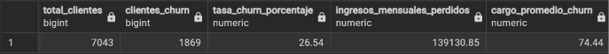

- **Auditoría financiera del valor histórico acumulado**

Se encontró que la pérdida acumulada por los clientes que abandonaron la compañía asciende a una cifra alarmante de $2.86 millones de USD en `TotalCharges`. Al contrastar este dato con los $13.19 millones de USD generados por la base de clientes retenidos, se demuestra que la deserción histórica ha drenado cerca del 18% del valor total del ciclo de vida del negocio, confirmando que el Churn es el principal inhibidor del crecimiento financiero a largo plazo.

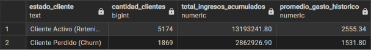

- **Evaluación operativa por tipo de infraestructura de internet**

Se encontró una preocupante paradoja operativa en el núcleo de conectividad del negocio: la Fibra Óptica registra una alarmante tasa de Churn del 41.89%, a pesar de ser el servicio que genera el cargo promedio más alto para la empresa ($93.90 USD). En contraste, los clientes con servicio DSL muestran un comportamiento sustancialmente más estable con una tasa de deserción de apenas el 18.96% y un cargo de $58.10 USD, lo que apunta a un serio problema de calidad o insatisfacción técnica en la oferta de alta velocidad.

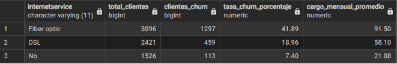

- **Evaluación del impacto de los servicios de asistencia y protección**

Se encontró que los servicios de valor agregado actúan como un ancla masiva de retención para el negocio. Los clientes que carecen de Seguridad en Línea o de Soporte Técnico registran tasas de Churn críticas que superan el 41% en ambos casos. Por el contrario, la habilitación de estas soluciones reduce el abandono drásticamente a rangos de entre el 14% y 15%, demostrando que la asistencia activa y la protección digital blindan la lealtad del usuario y mitigan la fricción con la compañía.

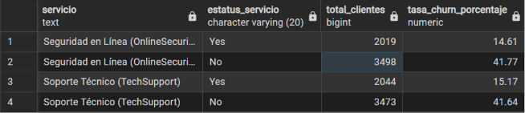

- **Correlación entre densidad de productos y lealtad del cliente**

Se encontró una relación inversamente proporcional entre el volumen de servicios de valor agregado contratados y la propensión al abandono. Los clientes que no cuentan con ningún servicio adicional presentan un Churn crítico del 49.85%, mientras que aquellos que integran un ecosistema robusto de 5 o 6 servicios reducen su tasa de deserción a niveles mínimos de entre el 3% y el 5%. Estos resultados comprueban que las estrategias de *cross-selling* no solo incrementan el ticket promedio, sino que son el mecanismo más efectivo para asegurar la retención.

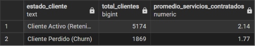

- **Mapeo del ciclo de vida y vulnerabilidad temporal del cliente**

Se encontró que el periodo de mayor riesgo de deserción se concentra de forma crítica en los primeros meses de relación con la compañía. Los clientes nuevos con menos de un año de antigüedad (`tenure < 12`) registran una alarmante tasa de Churn del 47.44%, concentrando el mayor volumen de bajas del negocio. Conforme avanza el ciclo de vida del usuario y este supera la barrera de los 24 meses, la lealtad se estabiliza de forma drástica, cayendo el Churn por debajo del 14%, lo que resalta la urgencia de blindar la experiencia durante el primer año.

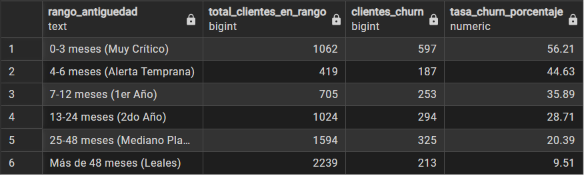

- **Auditoría de esquemas contractuales y estabilidad comercial**

Se encontró que la flexibilidad contractual del negocio representa su mayor vulnerabilidad financiera. Los clientes bajo la modalidad "Mes a Mes" (`Month-to-month`) exhiben una tasa de Churn crítica del 42.71%, concentrando la gran mayoría de las cancelaciones de la empresa. En un contraste radical, los esquemas de lealtad a largo plazo demuestran un blindaje operativo casi absoluto, reduciendo el abandono a un 11.27% en contratos de un año y a un minúsculo 2.83% en contratos a dos años, lo que confirma la necesidad de incentivar la migración de esquema.

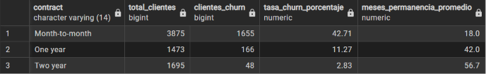

- **Auditoría de pasarelas de pago y comportamiento transaccional**

Se encontró que los canales de recaudación financiera tienen un impacto directo y desproporcionado en la retención. Los usuarios que utilizan el Cheque Electrónico (`Electronic check`) como método de pago registran una tasa de Churn crítica del 45.29%, convirtiéndose en el principal punto de fuga transaccional del negocio. Por el contrario, los clientes que adoptan métodos automatizados como la Tarjeta de Crédito o la Transferencia Bancaria muestran una deserción sustancialmente menor, oscilando entre el 15% y 16%, lo que evidencia la urgencia de desincentivar los procesos de cobro manuales.

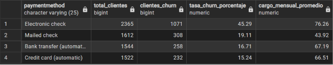

- **Auditoría de métodos de facturación y fricción digital**

Se encontró que la digitalización forzada de la facturación introduce un factor de fricción psicológica o conveniencia que impacta la retención. Los usuarios suscritos a la facturación electrónica (`PaperlessBilling = Yes`) registran una tasa de Churn del 33.57%, una cifra sustancialmente más alta en comparación con el 16.33% de aquellos que aún reciben su factura física tradicional (`PaperlessBilling = No`). Este patrón sugiere que los recordatorios digitales de cobro o la falta de un soporte tangible elevan la propensión al abandono del servicio.

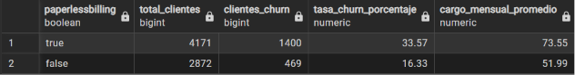

- **Diseño del modelo de Alerta Temprana para retención proactiva**

Se encontró que la concentración del riesgo financiero puede aislarse mediante algoritmos basados en reglas de negocio. Al cruzar las variables críticas identificadas en el análisis (contrato "Mes a Mes", uso de Cheque Electrónico y nula adopción de servicios de soporte), se logró segmentar y extraer un listado predictivo automatizado con los 500 clientes activos con mayor probabilidad de abandono. Este enfoque permite al equipo de retención pasar de una postura reactiva a una estrategia proactiva, interviniendo cuentas con un valor financiero agregado antes de que se formalice la baja.

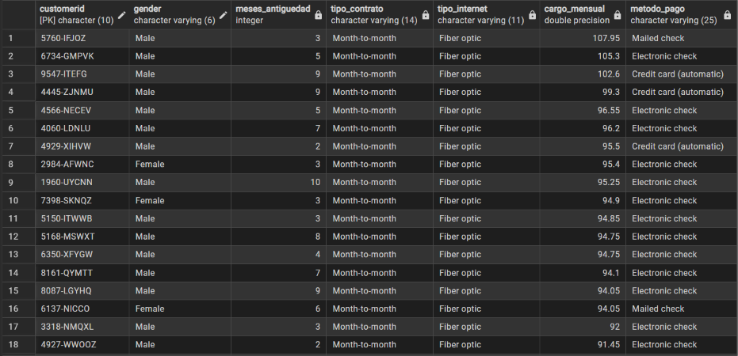

Explora más detalles del proyecto en el [repositorio completo](https://github.com/AndresASR-20/AndresASR-20.github.io/tree/main/assets/projects/project_Trends_Analysis_SQL).

---

## Análisis de rendimiento de ventas y análisis de cohortes

Este proyecto consistió en el análisis estratégico y la centralización de datos transaccionales masivos de Microsoft SQL Server (T-SQL) para diagnosticar la retención de clientes y optimizar el portafolio comercial de un importante marketplace de e-commerce en América Latina. Tras un riguroso proceso de ingesta y tipado de datos en SSMS, se desarrollaron tres modelos de análisis avanzado: una matriz horizontal de cohortes que mide los ciclos de vida de los usuarios mediante pivoteo condicional; un ranking de "productos estrella" por categoría utilizando funciones de ventana (DENSE_RANK()) para mitigar riesgos de inventario; y un modelo de suavizado temporal con ROWS BETWEEN para calcular la media móvil de demanda de 7 días, aislando la volatilidad natural de los fines de semana.

La solución dota a la empresa de un activo analítico clave que transforma millones de registros en un mapa de decisiones directivas para los equipos de Growth Marketing, Logística y Compras. Gracias a este diagnóstico, el negocio puede transicionar de una gestión puramente intuitiva a una estrategia proactiva, permitiendo diseñar campañas de lealtad hiper-dirigidas a los productos estrella de mayor valor, predecir con exactitud la capacidad de distribución con los transportistas y redefinir los esfuerzos de retención de usuarios para blindar y potenciar los ingresos de la compañía.

### Herramientas y Proceso de Datos

### Preguntas clave

1. ¿Los clientes que compran por primera vez en Olist regresan a comprar en los meses siguientes, o somos una plataforma de "una sola compra"? ¿Ha mejorado la retención de los clientes que adquirimos en 2017 en comparación con los de 2018? 
2. Si tuviéramos que hacer campañas de marketing hiper-segmentadas por categoría de producto, ¿cuáles son los 3 productos específicos (por ID) que están generando el mayor volumen de ventas en cada categoría para ponerlos en portada? ¿Hay categorías dominadas por un solo producto o la competencia interna es variada?
3. El volumen de ventas diario es sumamente ruidoso y tiene picos extraños (como el Black Friday). ¿Cómo podemos ver la tendencia real "suavizada" de las ventas diarias para que el equipo de operaciones pueda planificar la capacidad logística de los transportistas sin alarmarse por picos de un solo día?

### Metodología

- **Ingesta, limpieza y tipado estructural de datos**: Se ejecutó la importación de archivos planos a **SSMS** y se corrigieron inconsistencias de origen mediante la reconfiguración de tipos de datos complejos, transformando identificadores únicos a cadenas (`VARCHAR`), montos comerciales a valores decimales (`DECIMAL(10,2)`) y marcas de tiempo a formatos de fecha nativos (`DATETIME`), garantizando la integridad de los cálculos temporales.
- **Aislamiento cronológico y truncamiento temporal**: Se implementó una lógica de normalización de fechas utilizando la combinación matemática de las funciones `DATEADD` y `DATEDIFF` sobre el primer registro de compra (`MIN`), logrando truncar los timestamps crudos al primer día de su mes correspondiente para el establecimiento exacto de los periodos de inicio.
- **Modelado analítico de cohortes y pivoteo condicional**: Se estructuraron expresiones de tabla comunes (CTEs) secuenciales para calcular el índice de madurez del cliente y, mediante sentencias avanzadas de agregación condicional (`COUNT DISTINCT` con `CASE WHEN`), se transformó un flujo de registros vertical en una matriz horizontal que mapea el ciclo de vida y el goteo de retención de los usuarios.
- **Particionado y jerarquización de inventario**: Se unificaron las dimensiones de catálogo con los registros de órdenes mediante `JOINs` múltiples, aplicando la función de ventana analítica `DENSE_RANK() OVER (PARTITION BY ... ORDER BY ...)` para segmentar y extraer de forma compacta el Top 3 de productos con mayor recaudación por cada categoría de negocio sin omitir empates justos.
- **Suavizado de la demanda mediante Window Framing**: Se desarrolló un modelo de agregación móvil diario aplicando la cláusula de restricción de filas `ROWS BETWEEN 6 PRECEDING AND CURRENT ROW`, aislando eficazmente la volatilidad, el ruido transaccional y la estacionalidad natural de los fines de semana para exponer la tendencia real de la capacidad logística.
- **Filtrado y depuración del estado de operación**: Se integraron reglas de negocio rigurosas en la capa de persistencia mediante filtros de condición (`WHERE order_status = 'delivered'`), mitigando el sesgo de datos causado por órdenes canceladas o pendientes y asegurando que las conclusiones de retención y facturación se basaran exclusivamente en ingresos reales consolidados.

### Conclusiones y recomendaciones

- **Reestructuración de campañas hacia el ticket de alto valor**: Reorientar el presupuesto de pauta digital del equipo de Growth Marketing para promocionar de forma prioritaria los productos identificados en el Top 3 por facturación (como el ID líder de `health_beauty` que recauda más de $63k USD), priorizando el margen de ganancia por sobre los artículos que únicamente mueven volumen logístico de bajo costo.
- **Diversificación de proveedores en categorías monopolizadas**: Iniciar mesas de negociación para dar de alta a nuevos vendedores dentro de la categoría de Cama y Baño (`bed_bath_table`), mitigando el riesgo crítico de centralización donde el producto estrella número uno absorbe casi la totalidad de la demanda y expone a la plataforma a un desplome de ingresos ante eventuales rupturas de inventario.
- **Implementación de incentivos de lealtad post-compra (Cross-Selling)**: Diseñar una estrategia de automatización de correos (*Email Marketing*) y cupones de descuento válidos exclusivamente para los 30 y 60 días posteriores a la primera transacción, buscando romper la inercia del modelo actual donde menos del 1% de los usuarios de una cohorte regresa a realizar una segunda compra en el corto plazo.
- **Planificación de capacidad logística basada en demanda suavizada**: Desplegar el modelo de media móvil de 7 días (`Media_Movil_Ordenes_7D`) en los tableros operativos del centro de distribución, permitiendo al equipo de logística predecir y contratar la flota de transportistas necesaria según la tendencia real de la demanda, aislando el ruido y las falsas alarmas provocadas por las caídas naturales de volumen los fines de semana.
- **Fidelización y blindaje de sellers estratégicos**: Desarrollar un programa de beneficios exclusivos y comisiones reducidas para los vendedores que controlan los productos del Top 1 en categorías de alta competencia y fragmentadas (como `watches_gifts`), asegurando la permanencia de sus catálogos en Olist frente a la tentación de migrar hacia plataformas de la competencia.
- **Aislamiento y auditoría de órdenes rezagadas al cierre de mes**: Establecer un protocolo de revisión conjunta entre el equipo de Operaciones y Atención al Cliente durante las últimas semanas de cada mes, con el fin de destrabar y acelerar la transición al estado 'delivered' de los pedidos pendientes (fenómeno crítico observado en agosto de 2018), evitando que los desfases de entrega impacten negativamente la percepción de marca y el registro analítico de recompra.
- **Transición a un ecosistema de portafolio dinámico**: Automatizar el script de jerarquización (`DENSE_RANK`) para que se ejecute de forma estacional (trimestral), permitiendo al equipo comercial detectar de forma proactiva qué productos están perdiendo tracción frente a nuevas tendencias y garantizando que los banners principales del marketplace siempre muestren los artículos con la conversión orgánica más alta del momento.

### Visualizaciones destacadas

- **Matriz de análisis de cohortes para el diagnóstico de la tasa de recompra**

La consulta arrojó una estructura transaccional plana y de baja retención horizontal a lo largo de todo el ciclo de vida del usuario. Tomando como ejemplo la cohorte con mayor tracción de adquisición, 2017-11 (con 7,060 clientes iniciales), se observa que solo 40 usuarios regresaron a realizar una segunda transacción en el Mes_1 (una tasa de retención inmediata del 0.56%), estabilizándose en niveles marginales hacia el Mes_6 con solo 8 clientes activos. Este comportamiento generalizado en todas las cohortes demuestra que el crecimiento de Olist ha dependido críticamente de un motor de adquisición masiva de nuevos usuarios, evidenciando la ausencia de un ecosistema de fidelización orgánica a corto y mediano plazo.

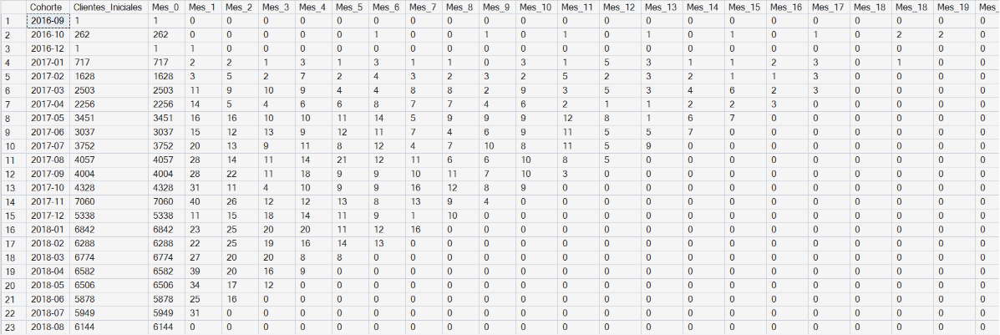

- **Jerarquización del portafolio comercial e identificación de productos estrella**

A través de la segmentación jerárquica por categoría, el análisis expuso agudas discrepancias operativas entre el volumen logístico y el valor financiero de los artículos. En la vertical de Cama y Baño (bed_bath_table), el producto líder (99a478...) demuestra una dominancia absoluta en el mercado con 488 unidades vendidas que consolidaron $43,025.56, generando una brecha crítica de dependencia frente a su Top 3 (84f456...), el cual solo recaudó $10,304.96. Por otro lado, en categorías de alta gama como Bebés (baby), el producto Top 1 (25c385...) lidera la facturación con $38,907.32 a pesar de registrar apenas 38 unidades vendidas, lo que confirma que la optimización del inventario y las campañas deben segmentarse por valor de ticket y no por rotación de almacén.

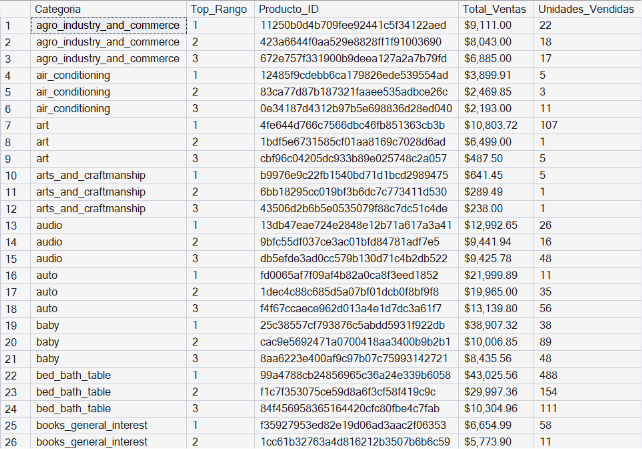

- **Suavizado temporal y estabilización analítica de la demanda diaria**

El cálculo de la media móvil evidencia cómo la volatilidad extrema de la operación diaria puede distorsionar el diagnóstico de la demanda real si se evalúa de forma aislada. Durante el arranque de operaciones en octubre de 2016, se observa un pico aislado el 2016-10-04 con $8,595.89 en ventas crudas y 54 órdenes, el cual se desploma drásticamente hacia el 2016-10-09 registrando apenas $2,399.70. Al aplicar la función analítica de 7 días (Media_Movil_Ventas_7D), el flujo se estabiliza de forma progresiva, mostrando una curva suavizada de $3,057.61 que asciende de manera sana hasta $5,309.36, aislando las caídas estacionales de los fines de semana y proveyendo un indicador confiable para la planeación logística de la flota transportista.

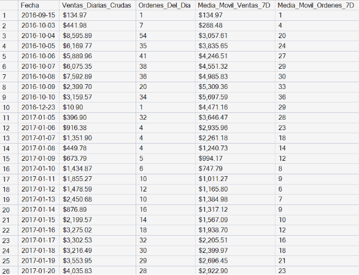

Explora más detalles del proyecto en el [repositorio completo](https://github.com/AndresASR-20/AndresASR-20.github.io/tree/main/assets/projects/project_Sales_Trend_Analysis_SQL).
